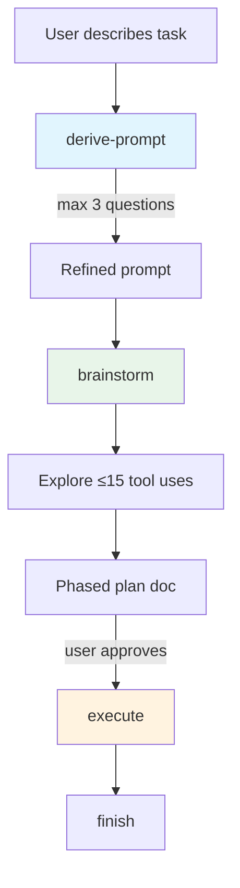
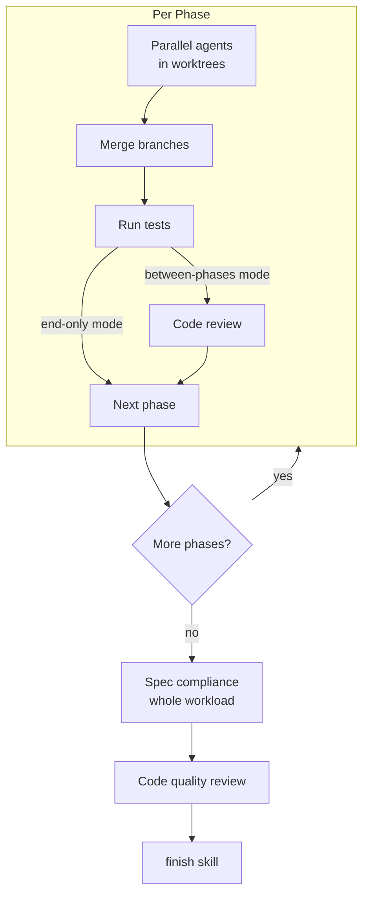
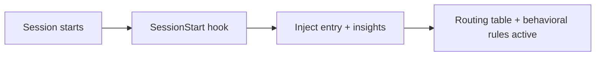
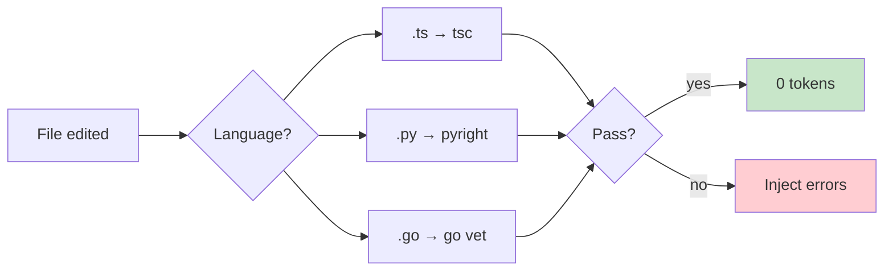

# Flows

## Planning Pipeline

```mermaid
flowchart TD
    user[User describes task] --> dp[derive-prompt]
    dp -->|max 3 questions| refined[Refined prompt]
    refined --> bs[brainstorm]
    bs --> explore[Explore ≤15 tool uses]
    explore --> plan[Phased plan doc]
    plan -->|user approves| exec[execute]
    exec --> finish[finish]

    style dp fill:#e1f5fe
    style bs fill:#e8f5e9
    style exec fill:#fff3e0
```

## Phase Execution

```mermaid
flowchart TD
    subgraph phase[Per Phase]
        dispatch[Parallel agents\nin worktrees] --> merge[Merge branches]
        merge --> tests[Run tests]
        tests -->|between-phases mode| review[Code review]
        tests -->|end-only mode| next[Next phase]
        review --> next
    end

    next --> more{More phases?}
    more -->|yes| phase
    more -->|no| spec[Spec compliance\nwhole workload]
    spec --> quality[Code quality review]
    quality --> finish[finish skill]
```

## Hidden: Session Injection

```mermaid
flowchart LR
    start[Session starts] --> hook[SessionStart hook]
    hook --> inject[Inject entry + insights]
    inject --> ready[Routing table + behavioral rules active]
```

## Hidden: PostToolUse Validation

```mermaid
flowchart LR
    edit[File edited] --> check{Language?}
    check --> ts[".ts → tsc"]
    check --> py[".py → pyright"]
    check --> go[".go → go vet"]
    ts & py & go --> result{Pass?}
    result -->|yes| silent[0 tokens]
    result -->|no| errors[Inject errors]

    style silent fill:#c8e6c9
    style errors fill:#ffcdd2
```
