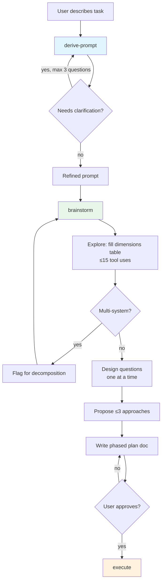
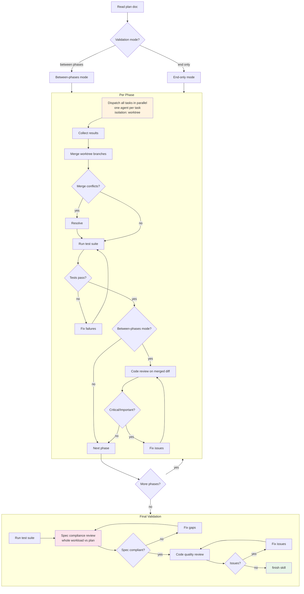
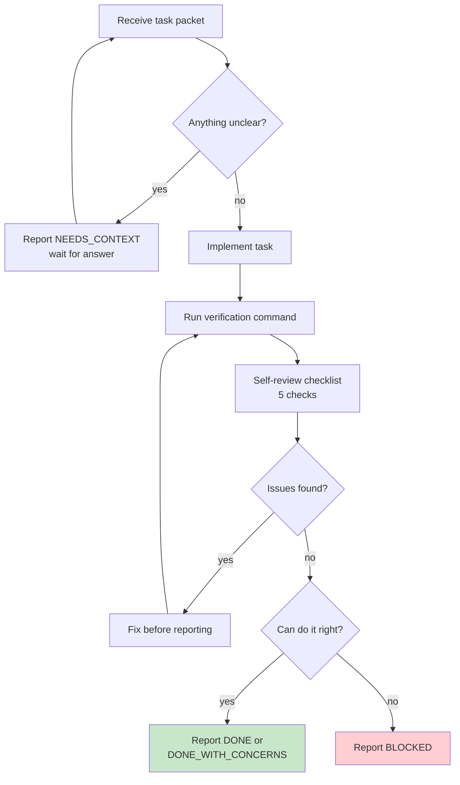
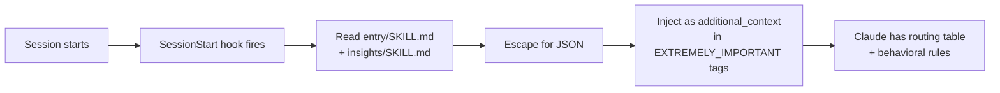
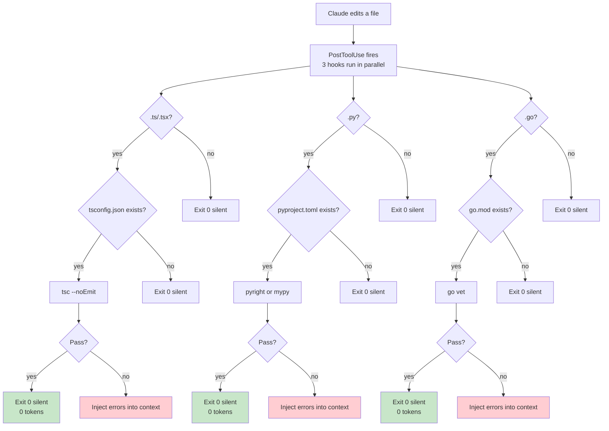
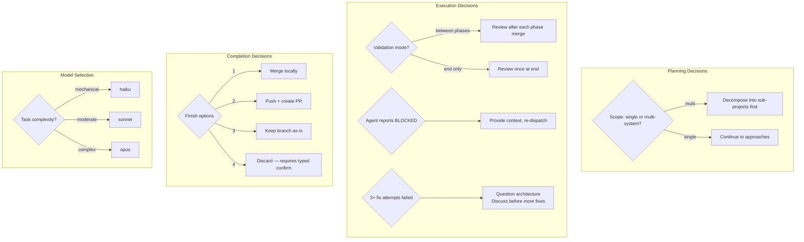
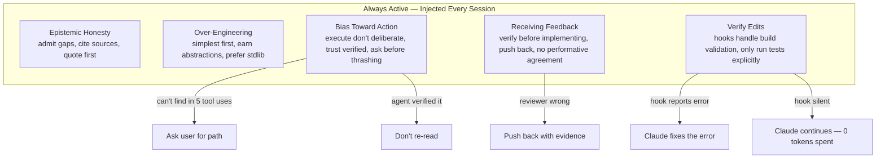

# Execution Flows

## Planning Pipeline

The primary flow triggered by `/snoodles:plan <task>`.

## Phase Execution

How `execute` dispatches parallel agents per phase.

## Agent Lifecycle

What happens inside each dispatched implementer agent.

## Hidden Flows

Processes that run automatically without Claude's involvement.

### Session Injection

### PostToolUse Validation

## Decision Points

Critical gates where the flow branches based on user input or system state.

## Behavioral Rules Flow

How `insights` rules interact with other skills.

